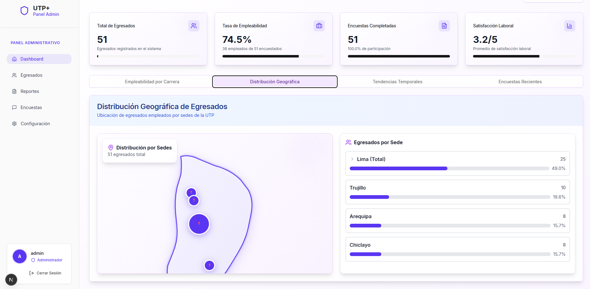
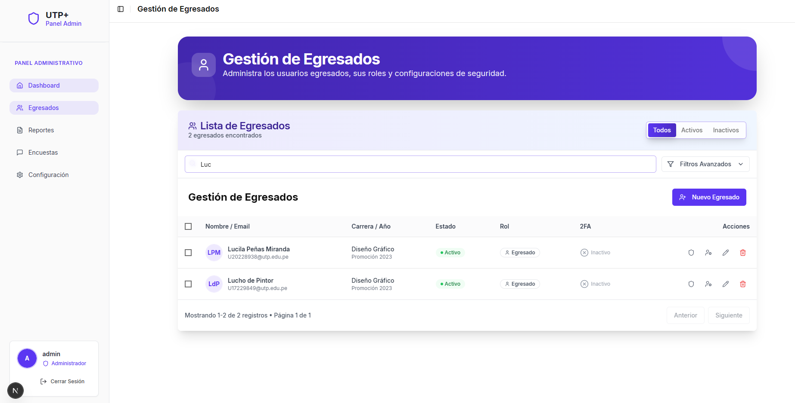
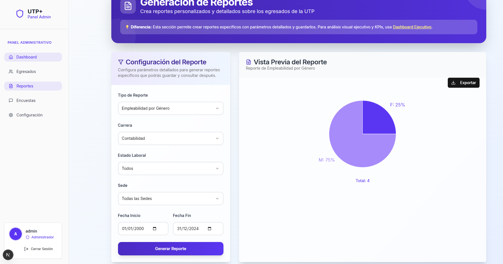
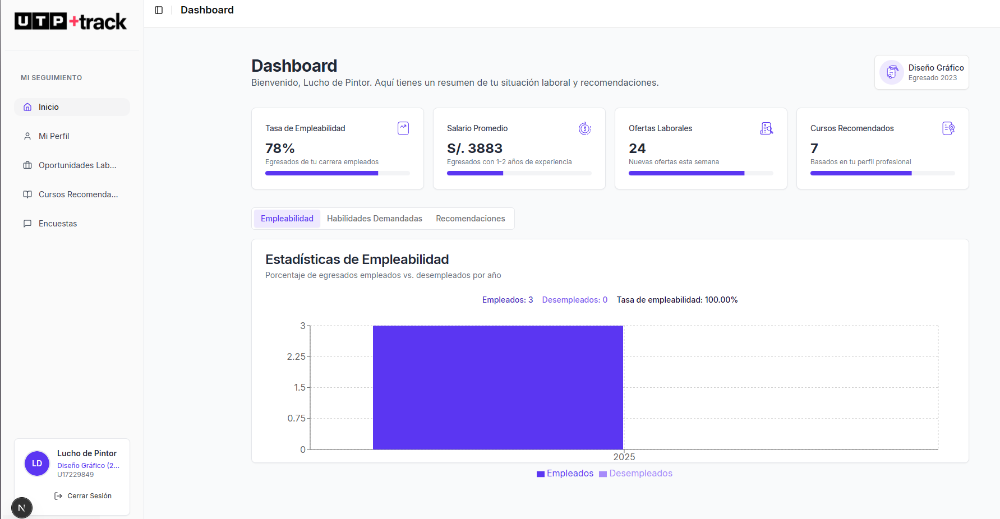
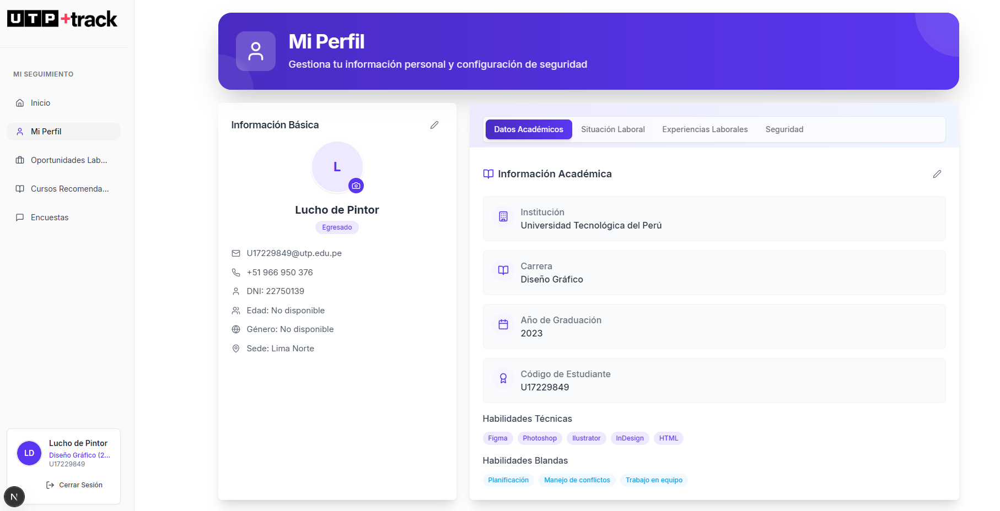
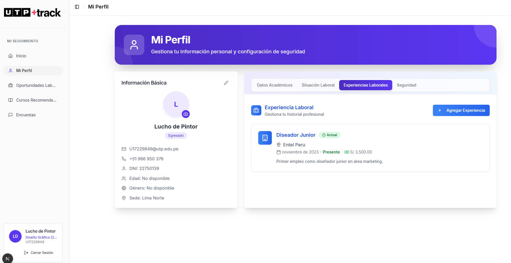
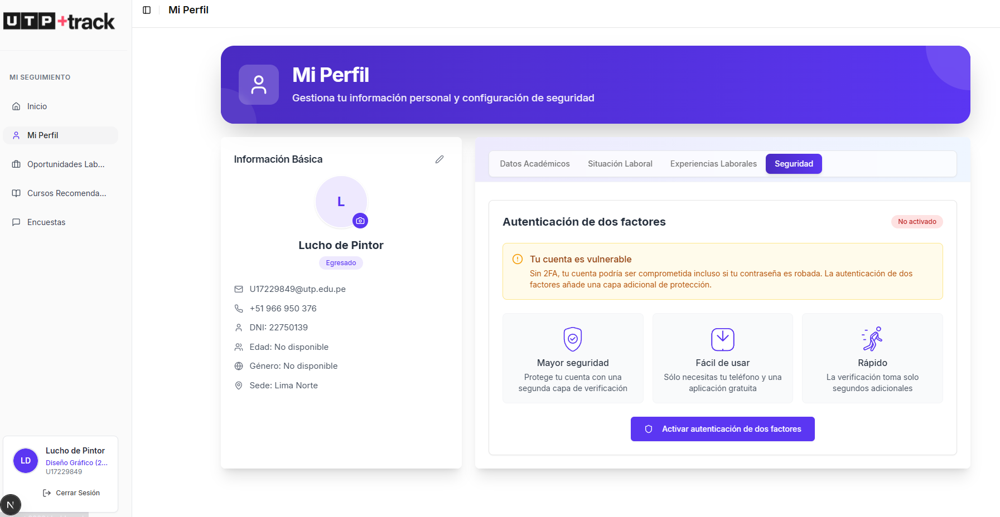

# 🎓 UTP Track - Sistema de Seguimiento de Egresados

Sistema integral para el seguimiento y análisis de egresados de la Universidad Tecnológica del Perú (UTP).

## 📋 Características Principales

- **Dashboard Ejecutivo** con KPIs en tiempo real
- **Gestión de Egresados** con CRUD completo
- **Reportes y Estadísticas** interactivos
- **Visualizaciones Geográficas** con mapas del Perú
- **Sistema de Encuestas** para seguimiento laboral
- **Autenticación JWT** con roles de usuario
- **Exportación** de datos en PDF y Excel

## 📱 Capturas de Pantalla

### 👑 Panel Administrativo

#### Dashboard Ejecutivo
Vista principal del administrador con KPIs, gráficos interactivos y estadísticas en tiempo real.



#### Gestión de Egresados
Lista completa de egresados con funciones de búsqueda, filtrado, edición y gestión de usuarios.



#### Sistema de Reportes
Generación de reportes personalizados con vista previa y exportación en PDF/Excel.



### 🎓 Panel de Egresado

#### Dashboard Personal
Vista personalizada para egresados con sus datos laborales y estadísticas personales.



#### Gestión de Perfil
Los egresados pueden actualizar su información personal, académica y laboral.

**Información Personal:**


**Experiencias Laborales:**


**Seguridad 2fa:**


## 🏗️ Arquitectura

### Frontend
- **Framework**: Next.js 15 con React
- **Lenguaje**: TypeScript
- **UI**: Tailwind CSS + shadcn/ui
- **Gráficos**: Recharts
- **Autenticación**: JWT con Context API

### Backend
- **Framework**: Spring Boot 3
- **Lenguaje**: Java
- **Base de Datos**: MySQL/PostgreSQL
- **ORM**: JPA/Hibernate
- **Seguridad**: Spring Security + JWT

## 🚀 Instalación y Configuración

### Prerrequisitos
- Node.js 18+ 
- Java 17+
- Maven 3.6+
- MySQL/PostgreSQL

### 1. Clonar el repositorio
```bash
git clone https://github.com/BrynRD/UTPTRACK.git
cd UTPTRACK
```

### 2. Configurar Backend
```bash
# Configurar base de datos en application.properties
cd backend
./mvnw spring-boot:run
```

### 3. Configurar Frontend
```bash
# En otra terminal
cd frontend
npm install
npm run dev
```

### 4. Configurar Base de Datos
- Crear base de datos `utptrack`
- Ejecutar el script `UTPTRACK.sql`
- Ajustar credenciales en `backend/src/main/resources/application.properties`


## 📊 Funcionalidades Principales

### Para Administradores
- ✅ Dashboard ejecutivo con KPIs en tiempo real
- ✅ Gestión completa de egresados (CRUD)
- ✅ Generación de reportes personalizados
- ✅ Visualización geográfica con mapas interactivos
- ✅ Exportación de datos en PDF y Excel
- ✅ Sistema de autenticación con 2FA
- ✅ Gestión de roles y permisos

### Para Egresados
- ✅ Dashboard personal con estadísticas
- ✅ Actualización de perfil completo
- ✅ Gestión de información laboral
- ✅ Historial de experiencias profesionales
- ✅ Configuración de seguridad personal
- ✅ Visualización de datos personales

## 🔧 Tecnologías Utilizadas

### Frontend
- **Next.js 15**: Framework React con SSR
- **TypeScript**: Tipado estático
- **Tailwind CSS**: Framework de estilos
- **shadcn/ui**: Componentes UI modernos
- **Recharts**: Gráficos y visualizaciones
- **Axios**: Cliente HTTP
- **React Context**: Gestión de estado

### Backend
- **Spring Boot 3**: Framework Java
- **Spring Security**: Autenticación y autorización
- **JWT**: Tokens de acceso
- **JPA/Hibernate**: ORM
- **MySQL**: Base de datos relacional
- **Maven**: Gestión de dependencias
- **Apache POI**: Generación de Excel
- **iText/PDFBox**: Generación de PDF

## 📁 Estructura del Proyecto

```
UTPTRACK/
├── frontend/                 # Aplicación Next.js
│   ├── app/                 # Pages y layouts
│   ├── components/          # Componentes React
│   ├── hooks/               # Hooks personalizados
│   └── public/              # Recursos estáticos
├── backend/                 # Aplicación Spring Boot
│   ├── src/main/java/       # Código fuente Java
│   ├── src/main/resources/  # Configuración
│   └── exports/             # Reportes generados
└── UTPTRACK.sql            # Script de base de datos
```

## 🤝 Contribución

1. Fork el proyecto
2. Crea tu rama de feature (`git checkout -b feature/AmazingFeature`)
3. Commit tus cambios (`git commit -m 'Add some AmazingFeature'`)
4. Push a la rama (`git push origin feature/AmazingFeature`)
5. Abre un Pull Request


